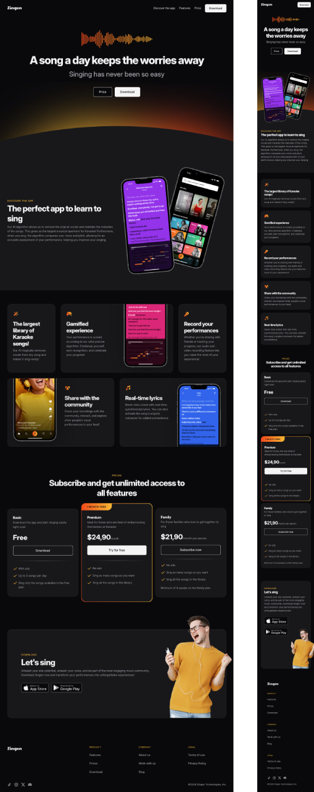

# 🎵 Zingen

Zingen is a **front-end educational project** built as part of a **Full Stack web development course**.  
The project focuses on practicing **semantic HTML5 and modern CSS techniques**, simulating the landing page of a music-related service.  

👉 **Live Demo:** [jujbraga.github.io/zingen](https://jujbraga.github.io/zingen/)

---

## 📸 Preview

---

## 🚀 Features

- 🎨 **Responsive design** using modern CSS
- 📱 Mobile-first layout
- 🖼️ Use of **flexbox** and **CSS grid**
- 🌐 Semantic HTML structure
- 🔤 Google Fonts integration
- 💡 Good practices for **accessibility** and **clean code**

---

## 🛠️ Technologies Used

- **HTML5**
- **CSS3**
- **Git & GitHub Pages** for deployment
- **Figma**

